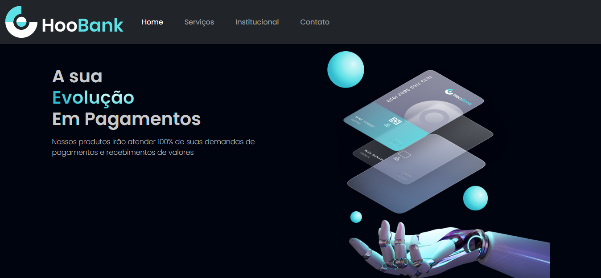
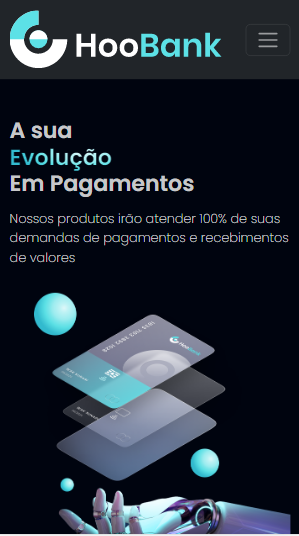

# HooBank

## Descrição
Site estático desenvolvido utilizando Bootstrap.

## Objetivo
Desenvolver uma página web com o auxílio de um framework que tem como foco principal a responsividade.
O desenvolvimento deste projeto visa estudar e praticar o uso do bootstrap.

## Detalhes

 
 

  <video src="./videos/video.mp4"></video>

## Autoria
### Autora
Ioly M. M. Oliveira

<h3>Fontes:</h3>

https://www.figma.com/file/bUGIPys15E78w9bs1l4tgS/HooBank?node-id=1%3A31

https://www.youtube.com/watch?v=xCkPC-ydMS4&t=680s

